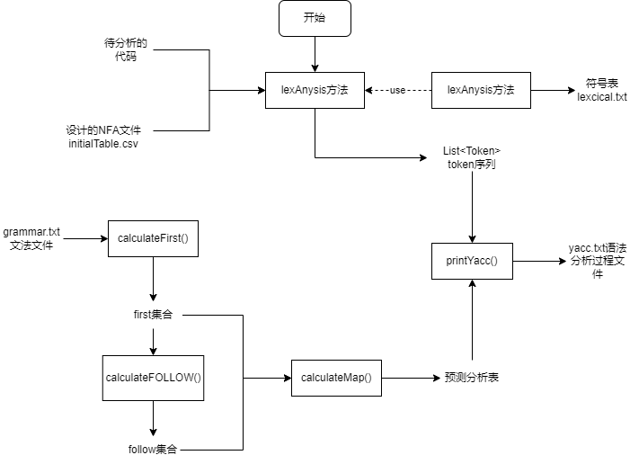
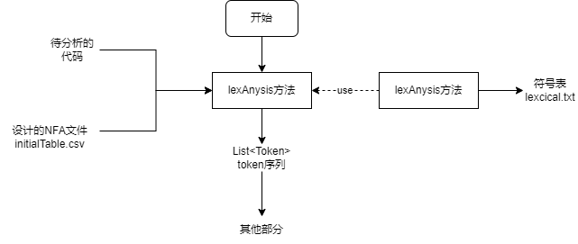

# Complier

## 背景说明

本项目为编译器的demo，sqlComplier为2022年上学期所写，目标编译语言是sql的简化语言; C--Complier为2023年上学期所写，目标编译语言是c的简化语言。

## C--Complier

### 一.整体概述

#### 1.1 整体流程

该编译器的demo的整体流程如下所示



#### 1.2 目录树介绍

项目的目录树如下

```powershell
D:\大学\课程\编译原理\MY大作业\C--COMPLIER\COMPLIER
    ├─.idea                                            
    │  ├─artifacts                                     
    │  ├─inspectionProfiles                            
    │  └─libraries
    ├─log
    ├─src
    │  ├─main
    │  │  ├─java
    │  │  └─resources
    │  └─test
    │      ├─java
    │      └─resources
    └─target
```

各文件夹的作用如下所示

- .idea: 使用idea的配置文件目录，在本地登录时请删除
- log: 记录错误日志的目录
- src: 源代码和程序所用资源所在的目录
  - main/java: 主体程序源码
  - main/resources: 程序主体所用的资源文件
  - test/java: 测试程序源码
  - test/resources: 测试程序所用的资源文件

- target: 编译后生成文件所在目录

#### 1.3 源码结构介绍

主体程序源码结构如下

```powershell
    src
    ├─lex
    │  ├─entity
    │  ├─implement
    │  └─itf
    ├─log
    ├─test
    ├─utils
    └─yacc
        ├─entity
        ├─implement
        └─itf
```

- lex: 词法分析器部分
  - entity：实体类
  - implement: 接口的实现类
  - itf: 对外开放的接口 
- log: 日志记录部分
- test: 最终生成的函数入口部分
- utils: 编码时用到的工具
- yacc: 语法分析部分
  - entity：实体类
  - implement: 接口的实现类
  - itf: 对外开放的接口
  
### 二.词法分析器简介

#### 2.1 词法分析器工作流程

词法分析器工作的主要流程由下图所示



#### 2.2 设计的NFA

NFA的设计图如下所示


由此设计出的initialTable如下图所示

| stateId | start | endSymbol | letter | digit | _    | +    | -    | *    | /    | %    | =    | $    | >    | <    | !    | &    | \|   | (    | )    | {    | }    | dot  | ;    |      | \n   | others |
| ------- | ----- | --------- | ------ | ----- | ---- | ---- | ---- | ---- | ---- | ---- | ---- | ---- | ---- | ---- | ---- | ---- | ---- | ---- | ---- | ---- | ---- | ---- | ---- | ---- | ---- | :----: |
| 1       | TRUE  | NOT_END   | 2      | 4     | 2    | 6    | 6    | 6    | 6    | 6    | 7    | 0    | 8    | 9    | 10   | 11   | 12   | 13   | 13   | 13   | 13   | 13   | 13   | 1    | 1    |   0    |
| 2       | FALSE | NOT_END   | 2      | 2     | 2    | 0    | 0    | 0    | 0    | 0    | 0    | 3    | 0    | 0    | 0    | 0    | 0    | 0    | 0    | 0    | 0    | 0    | 0    | 0    | 0    |   0    |
| 3       | FALSE | KW/IDN    | 0      | 0     | 0    | 0    | 0    | 0    | 0    | 0    | 0    | 0    | 0    | 0    | 0    | 0    | 0    | 0    | 0    | 0    | 0    | 0    | 0    | 0    | 0    |   0    |
| 4       | FALSE | NOT_END   | 0      | 4     | 0    | 0    | 0    | 0    | 0    | 0    | 0    | 5    | 0    | 0    | 0    | 0    | 0    | 0    | 0    | 0    | 0    | 0    | 0    | 0    | 0    |   0    |
| 5       | FALSE | INT       | 0      | 0     | 0    | 0    | 0    | 0    | 0    | 0    | 0    | 0    | 0    | 0    | 0    | 0    | 0    | 0    | 0    | 0    | 0    | 0    | 0    | 0    | 0    |   0    |
| 6       | FALSE | OP        | 0      | 0     | 0    | 0    | 0    | 0    | 0    | 0    | 0    | 0    | 0    | 0    | 0    | 0    | 0    | 0    | 0    | 0    | 0    | 0    | 0    | 0    | 0    |   0    |
| 7       | FALSE | NOT_END   | 0      | 0     | 0    | 0    | 0    | 0    | 0    | 0    | 6    | 6    | 0    | 0    | 0    | 0    | 0    | 0    | 0    | 0    | 0    | 0    | 0    | 0    | 0    |   0    |
| 8       | FALSE | NOT_END   | 0      | 0     | 0    | 0    | 0    | 0    | 0    | 0    | 6    | 6    | 0    | 0    | 0    | 0    | 0    | 0    | 0    | 0    | 0    | 0    | 0    | 0    | 0    |   0    |
| 9       | FALSE | NOT_END   | 0      | 0     | 0    | 0    | 0    | 0    | 0    | 0    | 6    | 6    | 0    | 0    | 0    | 0    | 0    | 0    | 0    | 0    | 0    | 0    | 0    | 0    | 0    |   0    |
| 10      | FALSE | NOT_END   | 0      | 0     | 0    | 0    | 0    | 0    | 0    | 0    | 6    | 0    | 0    | 0    | 0    | 0    | 0    | 0    | 0    | 0    | 0    | 0    | 0    | 0    | 0    |   0    |
| 11      | FALSE | NOT_END   | 0      | 0     | 0    | 0    | 0    | 0    | 0    | 0    | 0    | 0    | 0    | 0    | 0    | 6    | 0    | 0    | 0    | 0    | 0    | 0    | 0    | 0    | 0    |   0    |
| 12      | FALSE | NOT_END   | 0      | 0     | 0    | 0    | 0    | 0    | 0    | 0    | 0    | 0    | 0    | 0    | 0    | 0    | 6    | 0    | 0    | 0    | 0    | 0    | 0    | 0    | 0    |   0    |
| 13      | FALSE | SE        | 0      | 0     | 0    | 0    | 0    | 0    | 0    | 0    | 0    | 0    | 0    | 0    | 0    | 0    | 0    | 0    | 0    | 0    | 0    | 0    | 0    | 0    | 0    |   0    |


#### 2.3 词法分析器类简介

词法分析器主要类如下

```powershell
    lex
    ├─entity
    │      DFA.java
    │      NFA.java
    │      State.java
    │      StateList.java
    │      Token.java
    │
    ├─implement
    │      LexImpl.java
    │
    └─itf
    	   Lex.java
```

##### 2.3.1 lex.entity.DFA: 

是dfa实体，用来描述一个DFA

重要字段:

```java
    //所有状态的集合
    private List<State> allStates; 
    //字母表
    private String[] alpha; 
    // 状态转化表，因为是DFA，所以一个输入字符只会对应一个输出,List的序号对应`状态序号 - 1`
    private List<Map<String, Integer>> functionList; 
    //唯一初态
    private State startState;
    //终止状态集合 
    private List<State> endStates; 
```

重要方法:

```java
    /**
     * @param :
     * @return DFA 最小化后的DFA
     * @author ZhouXiang
     * @description 将所给的DFA最小化
     * @exception
     */
    public DFA minimizeDFA()
```

##### 2.3.2 lex.entity.NFA: 

NFA实体类,用来描述一个NFA

重要字段:

```java
    //所有状态的集合
    private List<State> allStates; 
    //字母表
    private String[] alpha;
    //状态转化表，因为是NFA，所以一个输入字符可能对应多个输出 
    private List<Map<String, Integer[]>> functionList; 
    //初始状态集合
    private List<State> startStates; 
    //终止状态集合
    private List<State> endStates; 
```

重要方法:

```java
    /**
     * @param :fileName 初始设计的NFA表文件所在路径
     * @return NFA
     * @author ZhouXiang
     * @description 获取初始的NFA，从文件中获取nfa
     * @exception 文件IO异常
     */
    public static NFA generateNFA(String fileName) throws IOException;
```

##### 2.3.3 lex.entity.State

状态的实体类，用来描述状态NFA和DFA中状态的变化

重要字段:

```java
	//状态id
	private int stateId;
	//是否为起始状态
    private boolean start; 
	//若为结束状态，则为其对应的标识的数组，否则为空数组
    private String[] endSymbol; 
	//状态转换表
    private Map<String, Integer[]> moveMap; 
```

##### 2.3.4 lex.entity.StateList

状态集合的实体类，是nfa确定化和dfa最小化的算法中间产生的实体类

重要字段

```java
	//集合中包含的状态
	private List<State> states; 
	//状态集合编号0
    private int stateListId; 
    //标识有没有起始状态
    private boolean start; 
    //若为结束状态，则为其对应的标识的数组，否则为null
    private String[] endSymbol; 
	//key为转移符号，value为转移到的状态集合编号
    //注意，这里的状态转移与a弧转换不同，只是简单的将所有状态的状态转移加和，没有算加和的空弧转换
    private Map<String, Integer[]> moveMap; 
```

##### 2.3.5 lex.entity.Token

输出Token序列中的Token实体类

重要字段

```java
    //符号种别
    private String type; 
    //符号对应的字符串内容
    private String content; 
	//符号在进行语法分析时的存在形式
    private String dealing; 
```

##### 2.3.6 lex.implement.LexImpl

是lex.itf.Lex的实现类，实现了lex.itf.Lex声明的抽象方法

##### 2.3.7 lex.itf.Lex

是词法分析器对外声明的接口，声明了词法分析器要实现的两个方法

```java
    /**
     * @param input: 输入的字符串
     * @return List<Token> 识别出的符号表
     * @author ZhouXiang
     * @description 将输入的字符串经过词法分析转为对应的token序列，输出Token序列
     */
    public List<Token> lexAnalysis(String input) throws IOException;

    /**
     * @param inputFile: 输入文件名
     * @param outputFile: 输出文件名
     * @return boolean: 是否输出成功
     * @author ZhouXiang
     * @description 对输入文件的语句进行词法分析，结果输出到输出文件中
     */
    public boolean lexAnalysisToFile(String inputFile,String outputFile) throws IOException;
```

#### 2.4 词法分析器主要算法

##### 2.4.1 NFA的获取

从initialTable.csv文件中获取NFA主要步骤如下


具体实现代码在lex.entity.NFA.generateNFA(String fileName)

```java
    public static NFA generateNFA(String fileName) throws IOException {
        List<State> stateList = new ArrayList<>();
        
        InputStream in = ClassLoader.getSystemResourceAsStream(fileName);
        Scanner scanner = new Scanner(in);

        String[] attribute = null; //存所有状态转移表的所有属性，即initialStateTable的第一行
        if(scanner.hasNextLine()){
            attribute = scanner.nextLine().split(",");
        }

        while (scanner.hasNextLine()){
            String[] line = scanner.nextLine().split(",");
            int stateId = -1;
            boolean start = false;
            String[] endSymbol = new String[0];
            //从表中读除了状态转移以外的数据
            for (int i = 0; i < line.length; i++){
                switch (attribute[i]){
                    case "stateId":
                        stateId = Integer.parseInt(line[i]);
                        break;
                    case "start":
                        if(line[i].equals("TRUE")){
                            start = true;
                        }
                        break;
                    case "endSymbol":
                        endSymbol = line[i].split("/");
                        break;
                    default:
                }
            }

            //取出状态转移的部分
            int attributeNum = 3; //State类中除状态转移Map外的属性数
            Integer[][] move = new Integer[line.length - attributeNum][];
            for(int i = 0; i < move.length; i++){
                String[] moveString = line[i + attributeNum].split("/");
                Integer[] moveInteger = new Integer[moveString.length];
                for(int j = 0; j < moveInteger.length; j++){
                    moveInteger[j] = Integer.parseInt(moveString[j]);
                }

                move[i] = moveInteger;
            }
            Map<String, Integer[]> moveMap = new HashMap<>();
            for(int i = 0; i < move.length; i++){
                moveMap.put(attribute[i + attributeNum], move[i]);
            }

            State state = new State(stateId, start, endSymbol, moveMap);

            stateList.add(state);
        }

        return NFA.getNFAInstance(stateList);
    }
```

##### 2.4.2  NFA的确定化

NFA确定化步骤：

1. 求nfa初始状态的闭包，将其放到转换结果`List<StateList> result`中去
2. 对于result中的每一个StateList，求其a弧转换，加入到result中去
3. 重复2，直到不再有新的StateList加入result
4. 将result转为对应的DFA

具体代码实现在lex.entity.NFA.determineNFA()

```java
public DFA determineNFA(){
        List<StateList> dfa1 = new ArrayList<>();

        StateList beginList = new StateList(startStates).moveWithBlank(this);
        dfa1.add(beginList);
        dfs(beginList, dfa1);

        //将StateList转为State
        List<State> dfa = new ArrayList<>();
        int cnt = 1;
        for(StateList stateList: dfa1){
            stateList.setStateListId(cnt);
            cnt++;
        }

        for (StateList stateList: dfa1){
            dfa.add(stateList.turn2State(dfa1, this));
        }

        return DFA.getDFAInstance(dfa);
    }

    //搜索整个nfa
    private void dfs(StateList stateList, List<StateList> result){
        List<StateList> tempStateList = new ArrayList<>(); //暂存一行中状态转移的StateList

        //求该stateList的所有a弧转换
        for(String input: alpha){
            //排除空弧转换的情况
            if(input.equals("$")){
                continue;
            }

            //当a弧转换找到的结果是什么都没有时，不要加入
            StateList temp = stateList.moveWithInput(input, this);
            if(!temp.getStates().isEmpty()){
                tempStateList.add(temp);
            }

        }

        //判断每一个StateList是否已经在收集的结果里了
        for(StateList list: tempStateList){
            boolean isRepeat = false;
            for(StateList stateList1: result){
                if(stateList1.equals(list)){
                    isRepeat = true;
                    break;
                }
            }

            if(!isRepeat){
                result.add(list);
                dfs(list, result);
            }
        }
    }
```

在本项目中，NFA确定化后的状态转换图为


##### 2.4.3 NFA的最小化

NFA最小化步骤：

1. 对NFA中的所有状态，根据endSymbol类型分成不同的组，将分组加入转换结果`List<StateList> curList`中
2. 对字母表中的每一个字母`input`，执行划分操作操作：
   1. 将`result`中的所有`StateList`加入队列`queue`中
   2. 从`queue`中取出一个`StateList`
   3. 求该`StateList`中每一个`State`的a弧转换的结果
   4. 根据每一个`State`的a弧转换结果是result中的哪一个StateList，将其分为不同的组
   5. 若只有一个分组，将其加入`List<StateList> finalList`中
   6. 若有多个分组，从`curList`中删除原分组，加入新分组，并将新分组入队
   7. 重复执行2-5，直到没有新分组入队

3. 对`curList`进行检查操作:
   1. 存储`curList`到`oldList`中，对字母表中的每一个字母`input`，执行划分操作操作
   2. 比较经过划分操作后的`curList`和`oldList`，若相同则进行4，否则继续进行检查操作

4. 将`finalList`转为对应的DFA

具体代码实现在`lex.entity.DFA.minimizeDFA()`中

```java
public DFA minimizeDFA(){
        List<StateList> curList = new ArrayList<>();
        //根据endSymbol的不同，对State进行第一次划分
        //因为java对String[]的比较未重写，所以要将String[]转为String
        Map<State, String> map =new HashMap<>();
        for (State state: this.allStates){
            StringBuilder sb = new StringBuilder();
            for(String str: state.getEndSymbol()){
                sb.append(str + "_");
            }
            map.put(state, sb.toString());
        }

        Set<String> set = new HashSet<>(map.values());
        for(String str: set){
            List<State> list = new ArrayList<>();
            for(Map.Entry<State, String> entry: map.entrySet()){
                State key = entry.getKey();
                String value = entry.getValue();
                if(value.equals(str)){
                    list.add(key);
                }
            }
            curList.add(new StateList(list));
        }

        for(String input: alpha){
            if(input.equals("$")){
                continue;
            }

            curList = separate(curList, input);
        }

        List<StateList> result = check(curList);

        //将StateList转为State
        List<State> dfa = new ArrayList<>();
        int cnt = 1;
        for(StateList stateList: result){
            stateList.setStateListId(cnt);
            cnt++;
        }

        for (StateList stateList: result){
            dfa.add(stateList.turn2State(result, this));
        }

        return DFA.getDFAInstance(dfa);
    }

    //检查，直到不发生改变
    private List<StateList> check(List<StateList> curList){
        List<StateList> oldList = curList;
        for(String input: alpha){
            if(input.equals("$")){
                continue;
            }
            curList = separate(curList, input);
        }
        if(!oldList.equals(curList)){
            check(curList);
        }
        return oldList;
    }

    //使用某字母对目前的dfa(List<StateList>)进行一次划分,返回划分后的结果
    private List<StateList> separate(List<StateList> curList, String input){
        List<StateList> finalStateList = new ArrayList<>();

        Queue<StateList> queue = new LinkedList<>();
        for (StateList list: curList){
            queue.offer(list);
        }
        List<StateList> oldList = new ArrayList<>(curList);

        while (!queue.isEmpty()){
            StateList tempStateList = queue.poll();

            //调试用
//            if(tempStateList.getStates().size() == 4){
//                int a = 0;
//            }

            //根据a弧转换，对tempStateList中的状态进行分类
            //tempStateList中的每一个State，会对应到一个StateList
            //取StateList为key，若不用划分，应只有一个键值对，否则，就要根据value划分成不同的StateList
            Map<StateList, List<State>> map = new HashMap<>();
            for(State state: tempStateList.getStates()){
                StateList next = state.getMove(this, input);

                Pair<StateList, List<State>> pair = personalGetOrDefault(map, next, new ArrayList<>());
                List<State> list = pair.getValue();
                list.add(state);
                map.put(pair.getKey(), list);

            }

            if(map.size() == 1){//包含在oldList里面，说明是最终分组
                finalStateList.add(tempStateList);
            }else {//不包含在oldList里面，删除原来的分组，创建新分组，将新分组入队
                oldList.remove(tempStateList);
                for(List<State> stateList: map.values()){
                    StateList stateList1 = new StateList(stateList);
                    oldList.add(stateList1);
                    queue.add(stateList1);
                }
            }
        }

        return finalStateList;
    }

    //实现getOrDefault功能，用api的无法比较StateList是否相同
    private static Pair<StateList, List<State>> personalGetOrDefault(Map<StateList, List<State>> map, StateList testKey, List<State> defaultResult){
        for(Map.Entry<StateList, List<State>> entry: map.entrySet()){
            StateList key = entry.getKey();
            List<State> value = entry.getValue();

            if(testKey.equals(key)){
                return new Pair<>(key, value);
            }
        }

        return new Pair<>(testKey, defaultResult);
    }
```

在本项目中，DFA确定化后的状态转换图如下


##### 2.4.4 Token序列的生成

根据最小化的DFA，获取待分析代码的Token序列的主要步骤如下:

1. 初始化当前状态为起始状态，初始化`firstLetter`，`curLetter`指针为第一个读入的字符，初始创建一个空的`List<Token> result`
2. 判断`curLetter`是否超过了`input`的长度，若超过了，跳到9；若没有，则从`curLetter`的位置读取一个字符
3. 对读入的字符进行预处理
4. 根据当前状态和遇到的字符，看还有没有下一个状态
5. 若有，则将`curLetter + 1`，然后跳转到2继续执行
6. 若没有，则判断当前状态是否是终结状态
7. 若是终结状态，读取`firstLetter`和`curLetter`之间的部分作为一个`Token`的`content`内容，目前`State`的`endSymbol`作为`Token`的`type`，将`firstLetter`指针移到`curLetter`位置，`curLetter + 1`，然后跳转到2继续执行
8. 若不是终结状态，说明代码存在错误，使用`Log.errorLog()`记录错误，退出程序
9. 遍历`result`，根据后面是`INT`，前面是`null || KW || INT || { || (`的原则找到要将`-`和`INT`合并成`INT`的位置
10. 遍历`result`，计算每一个`Token`的`dealing`，同时在要合并的地方对`-`和`INT`进行合并

具体实现代码在`lex.implement.LexImp`中

```java
public List<Token> lexAnalysis(String input) throws IOException {
        List<Token> tokens = new ArrayList<>();
        //加空格是为了保证能读取最后的token
        //当最后的字符的currentState为起始状态时，证明最后是由空格和\n组成的符号串，不该加入tokens，加入" "无影响
        //当最后的字符的currentState为非终结状态时，证明到最后了还没读到可判断断词的字符，说明出现错误，加入" "无影响
        //当最后的字符的currentState为终结状态时，因为所有终结状态遇到" "都会断词，且不会将最后一个" "读进，加入" "能帮助断词，否则该词就无法读进了
        input = input + " ";

        //获取dfa
//        String fileName = "D:\\大学\\课程\\编译原理\\My大作业\\C--Complier\\complier\\src\\main\\resources\\initialStateTable.csv";
//        String fileName = "./src/main/resources/config/initialStateTable.csv";
        //generateNFA是静态方法，用的是ClassLoader.getSystemResourceAsStream(fileName)获取输入流，前面不加/
        String fileName = "config/initialStateTable.csv";

        NFA nfa = NFA.generateNFA(fileName);
        DFA dfa = nfa.determineNFA();
        dfa = dfa.minimizeDFA();

        State currentState = dfa.getStartState(); //字符当前所处的状态
        int currentNum = 0; //当前识别到哪一个字符
        int startNum = 0; //每个token内容的开始字符
        int endNum = 0; //每个token内容的结束字符

        while (currentNum < input.length()){
            //字符预处理
            char currentChar = input.charAt(currentNum);
            String currentLetter = "";
            if(Character.isDigit(currentChar)){
                currentLetter = "digit";
            }else if(Character.isLetter(currentChar)){
                currentLetter = "letter";
            }else if(currentChar == ','){
                currentLetter = "dot";
            }else {
                currentLetter = String.valueOf(currentChar);
            }
            if(!Arrays.asList(dfa.getAlpha()).contains(currentLetter)){
                currentLetter = "others";
            }

            //找开始位置,会将空格，\n都去除
            if(currentState.isStart()){
                startNum = currentNum;
            }

//            if(currentChar == '}'){
//                int a = 1;
//            }

            //找结束位置
            State nextState = dfa.move(currentState, currentLetter);
            if(nextState == null){
                if(currentState.isEnd()){
                    endNum = currentNum;
                    String content = input.substring(startNum, endNum);
                    String type = "";
                    if(currentState.getEndSymbol().length == 1){
                        type = currentState.getEndSymbol()[0];
                    }else {
                        if(content.equals("int") || content.equals("void") || content.equals("return") || content.equals("const")){
                            type = "KW";
                        }else {
                            type = "IDN";
                        }
                    }

                    Token token = new Token(type, content);
                    tokens.add(token);

                    currentState = dfa.getStartState();
                }else {
                    String errorInfo = currentLetter + "不能被识别，它是输入的第" + currentNum + "个字符";
                    Log.errorLog(errorInfo, logger);
                    System.exit(1);
                }
            }else {
                currentState = nextState;
                //后移currentNum
                currentNum++;
            }
        }

        //处理负数
        //找到应该合并的位置
        List<Integer> list = new ArrayList<>();
        for(int i = 0; i < tokens.size(); i++){
            Token before = null;
            if(i != 0){
                before = tokens.get(i - 1);
            }
            Token cur = tokens.get(i);
            Token after = null;
            if(i != tokens.size() - 1){
                after = tokens.get(i + 1);
            }

            if(cur.getContent().equals("-") && after != null && after.getType().equals("INT")){
                if(before == null || before.getType().equals("KW") || before.getType().equals("OP")){
                    list.add(new Integer(i));
                }else {
                    if(before.getContent().equals("(") || before.getContent().equals("{")){
                        list.add(new Integer(i));
                    }
                }
            }
        }

        List<Token> result = new ArrayList<>();
        int skip = 0;
        for(int i = 0; i < tokens.size() - list.size(); i++){
            if(list.contains(i + skip)){
                String content = tokens.get(i + skip).getContent() + tokens.get(i + skip + 1).getContent();
                Token token = new Token("INT", content);
                //加入结果前要计算其在语法分析中的dealing
                token.calculateDealing();
                result.add(token);
                skip++;
            }else {
                Token token = tokens.get(i + skip);
                //加入结果前要计算其在语法分析中的dealing
                token.calculateDealing();
                result.add(token);
            }
        }

        return result;
    }
```

#### 2.5 词法分析器输出格式说明

##### 2.5.1 符号表`lexical.txt`说明

输出格式为

`[待测代码中的单词符号] [TAB] [单词符号种别] `


其中，单词符号种别为 KW（关键字）、OP（运算符）、SE（界符）、IDN（标识符）INT（整形数）；单词符号内容第一个维度为其种别，第二个维度为其属性。[TAB]为一个制表符‘\t’

##### 2.5.2 `Token`序列说明

Token序列是一个Token组成的List，即`List<Token>`，它是`lexAnalysis(String input)`方法的返回值，将作为参数，传入语法分析器中。

### 三. 语法分析器简介

#### 3.1 语法分析器工作流程

语法分析器工作流程如下


   

#### 3.2 文法文件与预测分析表

##### 3.2.1文法文件

文法文件grammar.txt由助教给出，具体如下：

```txt
program -> compUnit
compUnit -> decl compUnit
compUnit -> funcDef compUnit
compUnit -> $
decl -> constDecl
decl -> varDecl
constDecl -> const bType constDef argConst ;
argConst -> , constDef argConst
argConst -> $
constDef -> IDN = constInitVal
constInitVal -> constExp
constExp -> assignExp
varDecl -> bType varDef argVarDecl ;
argVarDecl -> , varDef argVarDecl
argVarDecl -> $
varDef -> IDN argVarDef
argVarDef -> = initVal
argVarDef -> $
initVal -> exp
bType -> int
funcDef -> funcType IDN ( funcFParams ) block
funcType -> void
funcFParams -> funcFParam argFunctionF
funcFParams -> $
argFunctionF -> , funcFParam argFunctionF
argFunctionF -> $
funcFParam -> bType IDN
block -> { blockItem }
blockItem -> decl blockItem
blockItem -> stmt blockItem
blockItem -> $
stmt -> exp ;
stmt -> ;
stmt -> block
stmt -> return argExp ;
callFunc -> ( funcRParams )
callFunc -> $
funcRParam -> exp
funcRParams -> funcRParam argFunctionR
funcRParams -> $
argFunctionR -> , funcRParam argFunctionR
argFunctionR -> $
argExp -> exp
argExp -> $
exp -> assignExp
assignExp -> eqExp assignExpAtom
assignExpAtom -> = eqExp assignExpAtom
assignExpAtom -> $
eqExp -> relExp eqExpAtom
eqExpAtom -> == relExp eqExpAtom
eqExpAtom -> != relExp eqExpAtom
eqExpAtom -> $
relExp -> addExp relExpAtom
relExpAtom -> < addExp relExpAtom
relExpAtom -> > addExp relExpAtom
relExpAtom -> <= addExp relExpAtom
relExpAtom -> >= addExp relExpAtom
relExpAtom -> $
addExp -> mulExp addExpAtom
addExpAtom -> + mulExp addExpAtom
addExpAtom -> - mulExp addExpAtom
addExpAtom -> $
mulExp -> unaryExp mulExpAtom
mulExpAtom -> * unaryExp mulExpAtom
mulExpAtom -> / unaryExp mulExpAtom
mulExpAtom -> % unaryExp mulExpAtom
mulExpAtom -> $
number -> INT
unaryExp -> number
unaryExp -> IDN callFunc
```

##### 3.2.2 预测分析表

程序分析过程中产生的预测分析表如下所示

|               | ==                               | <=                                 | void                                          | const                                        | %                                   | (                           | )                  | *                                   | +                                 | ,                                         | -                                 | INT                                    | int                                    | /                                   | IDN                                    | ;                           | {                           | !=                               | <                                 | =                                      | }              | return                      | >                                 | >=                                 |
| ------------- | -------------------------------- | ---------------------------------- | --------------------------------------------- | -------------------------------------------- | ----------------------------------- | --------------------------- | ------------------ | ----------------------------------- | --------------------------------- | ----------------------------------------- | --------------------------------- | -------------------------------------- | -------------------------------------- | ----------------------------------- | -------------------------------------- | --------------------------- | --------------------------- | -------------------------------- | --------------------------------- | -------------------------------------- | -------------- | --------------------------- | --------------------------------- | ---------------------------------- |
| argFunctionR  |                                  |                                    |                                               |                                              |                                     |                             | argFunctionR -> $  |                                     |                                   | argFunctionR -> , funcRParam argFunctionR |                                   |                                        |                                        |                                     |                                        |                             |                             |                                  |                                   |                                        |                |                             |                                   |                                    |
| eqExpAtom     | eqExpAtom -> == relExp eqExpAtom |                                    |                                               |                                              |                                     |                             | eqExpAtom -> $     |                                     |                                   | eqExpAtom -> $                            |                                   |                                        |                                        |                                     |                                        | eqExpAtom -> $              |                             | eqExpAtom -> != relExp eqExpAtom |                                   | eqExpAtom -> $                         |                |                             |                                   |                                    |
| decl          |                                  |                                    |                                               | decl -> constDecl                            |                                     |                             |                    |                                     |                                   |                                           |                                   |                                        | decl -> varDecl                        |                                     |                                        |                             |                             |                                  |                                   |                                        |                |                             |                                   |                                    |
| constInitVal  |                                  |                                    |                                               |                                              |                                     |                             |                    |                                     |                                   |                                           |                                   | constInitVal -> constExp               |                                        |                                     | constInitVal -> constExp               |                             |                             |                                  |                                   |                                        |                |                             |                                   |                                    |
| constDef      |                                  |                                    |                                               |                                              |                                     |                             |                    |                                     |                                   |                                           |                                   |                                        |                                        |                                     | constDef -> IDN = constInitVal         |                             |                             |                                  |                                   |                                        |                |                             |                                   |                                    |
| compUnit      |                                  |                                    | compUnit -> funcDef compUnit                  | compUnit -> decl compUnit                    |                                     |                             |                    |                                     |                                   |                                           |                                   |                                        | compUnit -> decl compUnit              |                                     |                                        |                             |                             |                                  |                                   |                                        |                |                             |                                   |                                    |
| funcRParam    |                                  |                                    |                                               |                                              |                                     |                             |                    |                                     |                                   |                                           |                                   | funcRParam -> exp                      |                                        |                                     | funcRParam -> exp                      |                             |                             |                                  |                                   |                                        |                |                             |                                   |                                    |
| addExp        |                                  |                                    |                                               |                                              |                                     |                             |                    |                                     |                                   |                                           |                                   | addExp -> mulExp addExpAtom            |                                        |                                     | addExp -> mulExp addExpAtom            |                             |                             |                                  |                                   |                                        |                |                             |                                   |                                    |
| program       |                                  |                                    | program -> compUnit                           | program -> compUnit                          |                                     |                             |                    |                                     |                                   |                                           |                                   |                                        | program -> compUnit                    |                                     |                                        |                             |                             |                                  |                                   |                                        |                |                             |                                   |                                    |
| addExpAtom    | addExpAtom -> $                  | addExpAtom -> $                    |                                               |                                              |                                     |                             | addExpAtom -> $    |                                     | addExpAtom -> + mulExp addExpAtom | addExpAtom -> $                           | addExpAtom -> - mulExp addExpAtom |                                        |                                        |                                     |                                        | addExpAtom -> $             |                             | addExpAtom -> $                  | addExpAtom -> $                   | addExpAtom -> $                        |                |                             | addExpAtom -> $                   | addExpAtom -> $                    |
| relExp        |                                  |                                    |                                               |                                              |                                     |                             |                    |                                     |                                   |                                           |                                   | relExp -> addExp relExpAtom            |                                        |                                     | relExp -> addExp relExpAtom            |                             |                             |                                  |                                   |                                        |                |                             |                                   |                                    |
| mulExpAtom    | mulExpAtom -> $                  | mulExpAtom -> $                    |                                               |                                              | mulExpAtom -> % unaryExp mulExpAtom |                             | mulExpAtom -> $    | mulExpAtom -> * unaryExp mulExpAtom | mulExpAtom -> $                   | mulExpAtom -> $                           | mulExpAtom -> $                   |                                        |                                        | mulExpAtom -> / unaryExp mulExpAtom |                                        | mulExpAtom -> $             |                             | mulExpAtom -> $                  | mulExpAtom -> $                   | mulExpAtom -> $                        |                |                             | mulExpAtom -> $                   | mulExpAtom -> $                    |
| funcRParams   |                                  |                                    |                                               |                                              |                                     |                             | funcRParams -> $   |                                     |                                   |                                           |                                   | funcRParams -> funcRParam argFunctionR |                                        |                                     | funcRParams -> funcRParam argFunctionR |                             |                             |                                  |                                   |                                        |                |                             |                                   |                                    |
| argVarDecl    |                                  |                                    |                                               |                                              |                                     |                             |                    |                                     |                                   | argVarDecl -> , varDef argVarDecl         |                                   |                                        |                                        |                                     |                                        | argVarDecl -> $             |                             |                                  |                                   |                                        |                |                             |                                   |                                    |
| initVal       |                                  |                                    |                                               |                                              |                                     |                             |                    |                                     |                                   |                                           |                                   | initVal -> exp                         |                                        |                                     | initVal -> exp                         |                             |                             |                                  |                                   |                                        |                |                             |                                   |                                    |
| number        |                                  |                                    |                                               |                                              |                                     |                             |                    |                                     |                                   |                                           |                                   | number -> INT                          |                                        |                                     |                                        |                             |                             |                                  |                                   |                                        |                |                             |                                   |                                    |
| argConst      |                                  |                                    |                                               |                                              |                                     |                             |                    |                                     |                                   | argConst -> , constDef argConst           |                                   |                                        |                                        |                                     |                                        | argConst -> $               |                             |                                  |                                   |                                        |                |                             |                                   |                                    |
| eqExp         |                                  |                                    |                                               |                                              |                                     |                             |                    |                                     |                                   |                                           |                                   | eqExp -> relExp eqExpAtom              |                                        |                                     | eqExp -> relExp eqExpAtom              |                             |                             |                                  |                                   |                                        |                |                             |                                   |                                    |
| funcFParams   |                                  |                                    |                                               |                                              |                                     |                             | funcFParams -> $   |                                     |                                   |                                           |                                   |                                        | funcFParams -> funcFParam argFunctionF |                                     |                                        |                             |                             |                                  |                                   |                                        |                |                             |                                   |                                    |
| block         |                                  |                                    |                                               |                                              |                                     |                             |                    |                                     |                                   |                                           |                                   |                                        |                                        |                                     |                                        |                             | block -> { blockItem }      |                                  |                                   |                                        |                |                             |                                   |                                    |
| mulExp        |                                  |                                    |                                               |                                              |                                     |                             |                    |                                     |                                   |                                           |                                   | mulExp -> unaryExp mulExpAtom          |                                        |                                     | mulExp -> unaryExp mulExpAtom          |                             |                             |                                  |                                   |                                        |                |                             |                                   |                                    |
| argExp        |                                  |                                    |                                               |                                              |                                     |                             |                    |                                     |                                   |                                           |                                   | argExp -> exp                          |                                        |                                     | argExp -> exp                          | argExp -> $                 |                             |                                  |                                   |                                        |                |                             |                                   |                                    |
| exp           |                                  |                                    |                                               |                                              |                                     |                             |                    |                                     |                                   |                                           |                                   | exp -> assignExp                       |                                        |                                     | exp -> assignExp                       |                             |                             |                                  |                                   |                                        |                |                             |                                   |                                    |
| constExp      |                                  |                                    |                                               |                                              |                                     |                             |                    |                                     |                                   |                                           |                                   | constExp -> assignExp                  |                                        |                                     | constExp -> assignExp                  |                             |                             |                                  |                                   |                                        |                |                             |                                   |                                    |
| funcType      |                                  |                                    | funcType -> void                              |                                              |                                     |                             |                    |                                     |                                   |                                           |                                   |                                        |                                        |                                     |                                        |                             |                             |                                  |                                   |                                        |                |                             |                                   |                                    |
| assignExp     |                                  |                                    |                                               |                                              |                                     |                             |                    |                                     |                                   |                                           |                                   | assignExp -> eqExp assignExpAtom       |                                        |                                     | assignExp -> eqExp assignExpAtom       |                             |                             |                                  |                                   |                                        |                |                             |                                   |                                    |
| relExpAtom    | relExpAtom -> $                  | relExpAtom -> <= addExp relExpAtom |                                               |                                              |                                     |                             | relExpAtom -> $    |                                     |                                   | relExpAtom -> $                           |                                   |                                        |                                        |                                     |                                        | relExpAtom -> $             |                             | relExpAtom -> $                  | relExpAtom -> < addExp relExpAtom | relExpAtom -> $                        |                |                             | relExpAtom -> > addExp relExpAtom | relExpAtom -> >= addExp relExpAtom |
| constDecl     |                                  |                                    |                                               | constDecl -> const bType constDef argConst ; |                                     |                             |                    |                                     |                                   |                                           |                                   |                                        |                                        |                                     |                                        |                             |                             |                                  |                                   |                                        |                |                             |                                   |                                    |
| assignExpAtom |                                  |                                    |                                               |                                              |                                     |                             | assignExpAtom -> $ |                                     |                                   | assignExpAtom -> $                        |                                   |                                        |                                        |                                     |                                        | assignExpAtom -> $          |                             |                                  |                                   | assignExpAtom -> = eqExp assignExpAtom |                |                             |                                   |                                    |
| callFunc      | callFunc -> $                    | callFunc -> $                      |                                               |                                              | callFunc -> $                       | callFunc -> ( funcRParams ) | callFunc -> $      | callFunc -> $                       | callFunc -> $                     | callFunc -> $                             | callFunc -> $                     |                                        |                                        | callFunc -> $                       |                                        | callFunc -> $               |                             | callFunc -> $                    | callFunc -> $                     | callFunc -> $                          |                |                             | callFunc -> $                     | callFunc -> $                      |
| bType         |                                  |                                    |                                               |                                              |                                     |                             |                    |                                     |                                   |                                           |                                   |                                        | bType -> int                           |                                     |                                        |                             |                             |                                  |                                   |                                        |                |                             |                                   |                                    |
| unaryExp      |                                  |                                    |                                               |                                              |                                     |                             |                    |                                     |                                   |                                           |                                   | unaryExp -> number                     |                                        |                                     | unaryExp -> IDN callFunc               |                             |                             |                                  |                                   |                                        |                |                             |                                   |                                    |
| argVarDef     |                                  |                                    |                                               |                                              |                                     |                             |                    |                                     |                                   | argVarDef -> $                            |                                   |                                        |                                        |                                     |                                        | argVarDef -> $              |                             |                                  |                                   | argVarDef -> = initVal                 |                |                             |                                   |                                    |
| funcFParam    |                                  |                                    |                                               |                                              |                                     |                             |                    |                                     |                                   |                                           |                                   |                                        | funcFParam -> bType IDN                |                                     |                                        |                             |                             |                                  |                                   |                                        |                |                             |                                   |                                    |
| varDef        |                                  |                                    |                                               |                                              |                                     |                             |                    |                                     |                                   |                                           |                                   |                                        |                                        |                                     | varDef -> IDN argVarDef                |                             |                             |                                  |                                   |                                        |                |                             |                                   |                                    |
| blockItem     |                                  |                                    |                                               | blockItem -> decl blockItem                  |                                     |                             |                    |                                     |                                   |                                           |                                   | blockItem -> stmt blockItem            | blockItem -> decl blockItem            |                                     | blockItem -> stmt blockItem            | blockItem -> stmt blockItem | blockItem -> stmt blockItem |                                  |                                   |                                        | blockItem -> $ | blockItem -> stmt blockItem |                                   |                                    |
| argFunctionF  |                                  |                                    |                                               |                                              |                                     |                             | argFunctionF -> $  |                                     |                                   | argFunctionF -> , funcFParam argFunctionF |                                   |                                        |                                        |                                     |                                        |                             |                             |                                  |                                   |                                        |                |                             |                                   |                                    |
| varDecl       |                                  |                                    |                                               |                                              |                                     |                             |                    |                                     |                                   |                                           |                                   |                                        | varDecl -> bType varDef argVarDecl ;   |                                     |                                        |                             |                             |                                  |                                   |                                        |                |                             |                                   |                                    |
| stmt          |                                  |                                    |                                               |                                              |                                     |                             |                    |                                     |                                   |                                           |                                   | stmt -> exp ;                          |                                        |                                     | stmt -> exp ;                          | stmt -> ;                   | stmt -> block               |                                  |                                   |                                        |                | stmt -> return argExp ;     |                                   |                                    |
| funcDef       |                                  |                                    | funcDef -> funcType IDN ( funcFParams ) block |                                              |                                     |                             |                    |                                     |                                   |                                           |                                   |                                        |                                        |                                     |                                        |                             |                             |                                  |                                   |                                        |                |                             |                                   |                                    |

#### 3.3 语法分析器类简介

语法分析器主要的类如下

```powershell
yacc
├─entity
│      Analysis.java
│      Grammar.java
│      Rool.java
│
├─implement
│      YaccImpl.java
│
└─itf
        Yacc.java

```

##### 3.3.1 yacc.entity.Analysis

使用预测分析表分析时每一条分析的实体类

主要字段如下

```java
	//操作序号
	private String no; 
    //使用的规则序号
    private String roolNo; 
    //栈顶符号
    private String stackSym; 
    //面对的输入符号
    private String faceSym; 
    //进行的动作
    private String action; 
```

##### 3.3.2 yacc.entity.Rool

每一条从`grammar.txt`中获取的规则的实体类

主要字段如下

```java
	//规则序号
	private String no;
    //规则左部
    private String left;
    //规则右部
    private String right;
```

##### 3.3.3 yacc.entity.Grammar

语法实体，一个文法文件对应一个Grammar实体，采用构造工厂模式，只能用`getGrammarInstance()`方式构建实例

主要字段如下

```java
	//非终结符集合
	private List<String> nonEndSymbol; 
    //终结符集合，此处将$也算在了终结符中
    private List<String> endSymbol; 
    //开始符号
    private String startSymbol; 
    //一条一条单个的规则
    private List<Rool> rools; 
	//一个非终结符对应的一组规则
    private Map<String,Set<String>> newRools; 
    //单个符号的first集合
    private Map<String, List<String>> first;
    //非终结符的follow集合
    private Map<String, Set<String>> nonFollow;
    // 存储在查找FOLLOW集合时非终结符的状态,仅在本类中使用
    private Map<String, Integer> status;
    //预测分析表，第一个String是非终结符，第二个是终结符
    private Map<String,Map<String, Rool>> predictMap;
```

主要方法如下

```java
	/**
     * @param :
     * @return Map<String,List<String>>
     * @author ZhouXiang
     * @description 计算本语法终结符与非终结符的First集
     */
    private Map<String,List<String>> calculateFirst();
    
	/**
     * @param :
     * @return void
     * @author ZhouXiang
     * @description 计算Fowllow集合
     */
    private void calculateFOLLOW();

	/**
     * @param :
     * @return void
     * @author ZhouXiang
     * @description 计算预测分析表
     */
    private void calculateMap();
```

##### 3.3.4 yacc.implement.YaccImpl

是yacc.itf.Yacc的实现类，实现了yacc.itf.Yacc中声明的抽象方法

##### 3.3.5 yacc.itf.Yacc

是语法分析器对外声明的接口，声明了语法分析器要实现的方法

```java
	/**
     * @param tokens: 词法分析产生的序列
     * @param filePath: 语法分析产生文件的路径
     * @return boolean 语法分析是否成功
     * @author ZhouXiang
     * @description 根据词法分析的结果，产生语法分析的结果，输入到文件中
     */
    public boolean printYacc(List<Token> tokens, String filePath) throws IOException;
```

#### 3.4 语法分析器主要算法

##### 3.4.1 Rool序列的获取

获取`Rool`序列的方法是按行读取`grammar.txt`文件，解析出每一条`Rool`的左部和右部

具体实现在`yacc.entity.Grammar.getGrammarByFile()`方法

```java
public static Grammar getGrammarByFile(String filePath,String start) throws IOException {
        List<Rool> rools = new ArrayList<>();
        List<String> nonEndSymbols = new ArrayList<>();
        List<String> endSymbols = new ArrayList<>();
        String roolStr = "";

        InputStream in = ClassLoader.getSystemResourceAsStream(filePath);
        Scanner scanner = new Scanner(in);

        int cnt = 1; //用于记录规则号
        while (scanner.hasNextLine()){
            roolStr = scanner.nextLine();
            if(roolStr.equals("")){
                continue;
            }

            //获取规则
            Rool rool = new Rool();
            String roolNo = String.valueOf(cnt);
            cnt++;
            String content = roolStr;
            String left = content.split("->",2)[0].trim();
            String right = content.split("->",2)[1].trim();
            rool.setNo(roolNo);
            rool.setLeft(left);
            rool.setRight(right);
            rools.add(rool);

            //获取非终结符，出现在左边的全是非终结符，且非终结符只会在左边出现
            if(!nonEndSymbols.contains(left)){
                nonEndSymbols.add(left);
            }

            //获取终结符，先将右边的符号都放进去，后面进行对右边的符号分割，去除终结符的操作
            if(!endSymbols.contains(right)){
                endSymbols.add(right);
            }
        }

        //对终结符，进行分割，去除终结符的操作
        List<String> realEndSymbols = new ArrayList<>();
        Iterator<String> it = endSymbols.iterator();
        while (it.hasNext()){
            String endSymbol = it.next();

            if(endSymbol.equals("{ blockItem }")){
                int a = 3;
            }

            //如果它是非终结符，不用加入
            if(nonEndSymbols.contains(endSymbol)){;
                continue;
            }
            String[] endSymbolStr = endSymbol.split(" ");
            //进行分割，找终结符
            if(endSymbolStr.length != 1){
                for(int j = 0;j < endSymbolStr.length;j++){
                    if(!nonEndSymbols.contains(endSymbolStr[j]) && !realEndSymbols.contains(endSymbolStr[j])){
                        realEndSymbols.add(endSymbolStr[j]);
                    }
                }
                it.remove();
            }else {
                realEndSymbols.add(endSymbol);
            }
        }
        endSymbols = realEndSymbols;

        //对非终结符与终结符去重
        Set<String> set = new HashSet<>(nonEndSymbols);
        nonEndSymbols.clear();
        nonEndSymbols.addAll(set);

        set = new HashSet<>(endSymbols);
        endSymbols.clear();
        endSymbols.addAll(set);

        Grammar grammar = new Grammar(nonEndSymbols,endSymbols,start,rools);
        return grammar;
    }
```

##### 3.4.2 First集合的计算

计算First集合的规则是：

- 如果x是终结符，`FIRST(x)`为`{x}`。
- 如果x是空串，`FIRST(x)`为`{空串}`。
- 如果x是非终结符，`x->Y1Y2Y3...`，逐步地从Y1计算起，如果Y1的FIRST集包含空串，将`FIRST(Y1)-空串`加入到`FIRST(X)`，继续计算`FIRST(Y2)`，... ，如果计算到某个符号`Yn`不包含空串，就结束计算。如果计算到最后一个符号也包含空串，也就是说`Y1Y2Y3...->空串`，则加入最后一个符号的FIRST集。

计算某一个符号的First集合的主要步骤如下：

1. 对单个终结符，其First集合是它自身，返回自身所形成的`List<String>`
2. 对单个非终结符`a`
   1. 初始化其First集合`List<String> result`为空
   2. 遍历文法的`Rool`，找到`rool.right`中包含`a`的所有`rool.right`
   3. 求这些`rool.right`的First集合，将其加入到`result`中
   4. 返回`result`
3. 对所有不止一个的符号S，将S用空格分割成`String[] patterns`，初始化其First集合`List<String> result`为空
   1. 若`paterns[0]`是终结符，`result.add(patterns[0])`，返回`result`
   2. 若`patterns[0]`不是终结符，遍历整个`patterns`，遍历过程中执行下面的操作
      1. 计算`patterns[i]`的First集合`patternsFirst`
      2. 判断`patternsFirst`是否包含`空(在本程序中用$替代)`
      3. 若不包含，执行`result.addAll(patternsFirst)`，结束遍历
      4. 若包含，判断是否是最后一个符号(即`i == patterns.length - 1`)
      5. 若是最后一个符号，执行`result.addAll(patternsFirst)`
      6. 若不是最后一个符号，将`patternsFirst`去掉`$`，执行`result.addAll(patternsFirst)`
   3. 返回`result`

具体代码实现在`yacc.entity.Grammar.calculateFirst()`中

```java
private Map<String,List<String>> calculateFirst(){
        Map<String,List<String>> result = new HashMap<>();

        //终结符，first集合是他本身
        for(String endSymbol : this.endSymbol){
            List<String> first = new ArrayList<>();
            first.add(endSymbol);
            result.put(endSymbol,first);
        }

        //非终结符，first集合要递归地计算
        for(String nonSymbol : this.nonEndSymbol){
//            if(nonSymbol.equals("querySpecification unionStatements")){
//                System.out.println("error");
//            }
            result.put(nonSymbol,getFirstBySingle(nonSymbol));
        }

        return result;
    }


    private List<String> getFirstBySingle(String symbol){
        Set<String> result = new HashSet<>();

        if(this.endSymbol.contains(symbol)){ //单个终结符，first集合是自身
            result.add(symbol);

        } else if(this.nonEndSymbol.contains(symbol)){ //单个非终结符，其First集合是其所在的，所有产生该非终结符的规则的右部，的first集合之和
            Set<String> rights = this.newRools.get(symbol);
            for(String right : rights){
                result.addAll(this.getFirstBySingle(right));
            }

        }else {//处理有几个符号的情况
            String[] patterns = symbol.split(" ");
            if(this.endSymbol.contains(patterns[0])){
                //第一个符号是终结符，其first集合就是这个终结符
                result.add(patterns[0]);
            } else {
                for(int i = 0;i < patterns.length;i++){
                    List<String> patternsFirst = this.getFirstBySingle(patterns[i]);
                    if(!patternsFirst.contains("$")){
                        result.addAll(patternsFirst);
                        break;
                    } else {
                        if(i == patterns.length - 1){
                            result.addAll(patternsFirst);
                        }else {
                            patternsFirst.remove("$");
                            result.addAll(patternsFirst);
                        }
                    }
                }
            }
        }

        List<String> realResult = new ArrayList<>(result);
        return realResult;
    }
```

##### 3.4.3 Follow集合的计算

计算Follow集合，按以下方式进行处理:

- 对于开始符号S，先将界符加入到其FOLLOW集中。

- 对于`A->aBp`，如果`p`不能推导出空串，就将`FIRST(p)`加入到B的FOLLOW集。
- 如果`p`能推导出空串，就将`FIRST(p)-空串`和`FOLLOW(A)`加入到B的FOLLOW集。

具体的实现在`yacc.entity.grammar`中

```java
private void calculateFOLLOW(){

        status = new HashMap<>();

        nonFollow = new HashMap<>();

        for (String character : this.nonEndSymbol) {

            // 初始化非终结符的状态
            // 状态1表示还没找过
            // 状态2表示正在查找
            // 状态3表示已经结束查找
            status.put(character, 1);
            nonFollow.put(character, new HashSet<>());
        }

        // 首先在开始符号的FOLLOW集中加入界符
        Set<String> startFollow = new HashSet<>();
        startFollow.add("#");
        this.nonFollow.put(this.startSymbol, startFollow);

        for (String character : this.nonEndSymbol){
            // 如果已经查找完，就跳过
            if (status.get(character) == 3){
                continue;
            }

            FOLLOWx(character);
        }
}

private Set<String> FOLLOWx(String x){
        // 首先置当前查找的非终结符的状态为正在查找
        status.put(x, 2);

        // 在产生式中搜索所有非终结符出现的位置
        for (String character : this.nonEndSymbol){
            Set<String> rightSet = this.newRools.get(character);
            String[] rightItems = rightSet.toArray(new String[rightSet.size()]);

            RightItemLoop:for (String item : rightItems){
                // 获取符号列表
                List<String> cList = this.disassemble(item);

                // 接下来，搜索当前查找的非终结符的位置
                for (int i=0; i<cList.size(); i++){
                    String nonEndChar = cList.get(i);
                    if (nonEndChar.equals(x)){
                        // 判断是否处于最右的位置
                        if (i < cList.size() - 1){
                            // 如果没在最右边的位置
                            // 下面循环判断后一个符号是否是非终结符
                            for (int j=i+1; j<cList.size(); j++){
                                String nextChar = cList.get(j);
                                if (this.nonEndSymbol.contains(nextChar)){
                                    // 如果是非终结符，查看其FIRST集是否包含空串
                                    Set<String> nextFirst = this.first.get(nextChar).stream().collect(Collectors.toSet());
                                    // 如果包含空串，并且此时这个符号是最后一个符号
                                    // 就要将其FIRST除去空串的集合加入FOLLOW集，且左部的FOLLOW集加入FOLLOW集
                                    if (nextFirst.contains("$")){
                                        // 判断是否是最后一个符号
                                        if (j == cList.size() - 1){
                                            // 这里首先判断一下要递归查找的非终结符的状态
                                            // 如果为正在查找，就会陷入死循环
                                            // 所以要略过这一条产生式
                                            // 在略过产生式之前，因为直接略过会遗漏掉之前正在查找的非终结符的FOLLOW集中的元素，所以要加上
                                            if (status.get(character) == 2){
                                                Set<String> follow = this.nonFollow.get(character);
                                                if (follow.size() != 0){
                                                    addCharsToFOLLOW(follow, x);
                                                }
                                                continue RightItemLoop;
                                            }
                                            Set<String> leftFOLLOW = FOLLOWx(character);
                                            Set<String> nextFirstExceptNULL = new HashSet<>(nextFirst);
                                            nextFirstExceptNULL.remove("$");
                                            addCharsToFOLLOW(leftFOLLOW, x);
                                            addCharsToFOLLOW(nextFirstExceptNULL, x);
                                        } else{
                                            // 如果不是最后一个符号，将FIRST集合加入
                                            Set<String> nextFirstExceptNULL = new HashSet<>(nextFirst);
                                            nextFirstExceptNULL.remove("$");
                                            addCharsToFOLLOW(nextFirstExceptNULL, x);
                                        }
                                    } else{
                                        // 如果不包含空串加入FIRST之后跳出循环
                                        addCharsToFOLLOW(nextFirst, x);
                                        break;
                                    }
                                } else{
                                    // 如果不是非终结符，把此符号加入到当前查找的非终结符的FOLLOW集中
                                    addCharToFOLLOW(nextChar, nonEndChar);
                                    break;
                                }
                            }
                        }
                        // 如果在最右边，将FOLLOW（左部）加入到当前非终结符的FOLLOW集合
                        else{
                            // 这里首先判断一下要递归查找的非终结符的状态
                            // 如果为正在查找，就会陷入死循环
                            // 所以要略过这一条产生式
                            // 在略过产生式之前，因为直接略过会遗漏掉之前正在查找的非终结符的FOLLOW集中的元素，所以要加上
                            if (status.get(character) == 2){
                                Set<String> follow = this.nonFollow.get(character);
                                if (follow.size() != 0){
                                    addCharsToFOLLOW(follow, x);
                                }
                                continue RightItemLoop;
                            }
                            Set<String> leftFOLLOW = FOLLOWx(character);
                            addCharsToFOLLOW(leftFOLLOW, x);
                        }
                    }
                }
            }
        }

        // 如果return，说明已经查找完
        status.put(x, 3);
        return this.nonFollow.get(x);
}
    
```

##### 3.4.5 预测分析表的计算

计算步骤如下：

1. 将预测分析表M的所有位置置为`errorRool`
2. 遍历所有的`Rool`，执行2，3步
3. 求`rool.right`的First集合，对其中的每一个终结符`a`，把`M[rool.left, a]`置为`rool`
4. 若`rool.right`的First集合中有`$(空)`，对`rool.left`的Follow集合中的每一个终结符`b`，把`M[rool.left, b]`置为`rool`	

具体实现在`yacc.entity.Grammar.calculateMap()`中

```java
private void calculateMap(){
        this.predictMap = new HashMap<>();

        Rool error = new Rool("error","error","error");
        //初始化，置为error
        for (String nonEnd : this.nonEndSymbol){
            Map<String,Rool> map = new HashMap<>();
            for(String end : this.endSymbol){
                if(end.equals("$")){
                    continue;
                }
                map.put(end,error);
            }
            this.predictMap.put(nonEnd,map);
        }


        //遍历rool来看预测分析表
        for (Rool rool : this.rools){

            List<String> first = this.getFirstBySingle(rool.getRight()); //右边的first集合
            Set<String> follow = this.nonFollow.get(rool.getLeft()); //左边的follow集合，左边必定是非终结符
            String non = rool.getLeft();

            //在终结符中加#,此时$还包含在endSymbol中
            List<String> newSym = new ArrayList<>(this.endSymbol);
            newSym.add("#");


            if(!first.contains("$")){
                for(String end : newSym){
                    //去掉endSymbol中的$的影响
                    if(end.equals("$")){
                        continue;
                    }
                    if(first.contains(end)){
                        editPredictMap(non,end,rool);
                    }
                }
            }else {
                for(String end : newSym){
                    if(end.equals("$")){
                        continue;
                    }
                    if(first.contains(end)){
                        editPredictMap(non,end,rool);
                    }
                }

                for(String endB : newSym){
                    if (endB.equals("$")){
                        continue;
                    }

                    if(follow.contains(endB)){
                        editPredictMap(non,endB,rool);
                    }
                }
            }
        }

    }
```

##### 3.4.5 语法分析过程文件的生成

根据Token序列和预测分析表来生成语法分析过程文件yacc.txt的过程如下：

1. 初始化一个`stack`，将`#`和开始符号入栈，在Token序列末端加上`#`，初始化token序列的指针i
2. 判断`stack`是否为空
3. 若为空，执行14
4. 若不为空，从栈中取出(不移除)栈顶元素`now`，从token中取出`token[i]`为`face`
5. 若`now`与`face`相同，判断是不是`#`，
6. 若都为`#`，则操作为`accept`，执行
7. 若不是`#`，则操作为`move`，移除栈顶元素，`i++`
8. 若`now`与`face`不同，查找`M[now, face]`的`rool`
9. 若`rool`为`error`，则说明语法分析遇到错误，记日志，退出程序
10. 若`rool`不为`error`，则操作为`reduction`，如果`rool.right`是不是为`$(空)`
11. 若`rool.right`为`$(空)`，从`stack`中移除栈顶元素
12. 若`rool.right`不为`$(空)`，从`stack`中移除栈顶元素，将`rool`右边的元素入栈
13. 执行2
14. 遍历储存的`analysis`信息
15. 将每一条`analysis`信息输出到语法分析过程文件yacc.txt中

具体实现在`yacc.implement.YaccImpl.printYacc()`中

```java
public boolean printYacc(List<Token> tokens, String filePath) throws IOException {
        String grammarFile = "config/grammar.txt";
        Grammar grammar = Grammar.getGrammarByFile(grammarFile, "program");

        Stack<String> stack = new Stack<>();
        Map<String,Map<String, Rool>> table = grammar.getPredictMap();

        stack.push("#");
        stack.push(grammar.getStartSymbol());
        List<Analysis> analysises = new ArrayList<>();
        Token endToken = new Token("#","#");
        endToken.calculateDealing();
        tokens.add(endToken);

        int i = 0;
        Integer analysisNo = 1;
        while (!stack.empty()){

            Token token = tokens.get(i);
            Analysis analysis = new Analysis();

            analysis.setNo(analysisNo.toString());
            analysis.setStackSym(stack.peek());
            analysis.setFaceSym(token.getDealing());

            String now = analysis.getStackSym();
            String face = analysis.getFaceSym();

            //调试使用
//            if(now.equals("compUnit") && !face.equals("void")){
//                int a = 3;
//            }

            if(now.equals(face)){
                if(now.equals("#")){
                    analysis.setAction("accept");
                    analysis.setRoolNo("/");
                    analysises.add(analysis);
                    break;
                }else {
                    analysis.setAction("move");
                    analysis.setRoolNo("/");
                    analysises.add(analysis);

                    stack.pop();
                    i++;

                }
            } else {
                Rool rool = this.dictionary(now,face,table);
                if(rool.getNo() == "error"){
                    analysis.setAction("error");
                    analysis.setRoolNo("/");
                    analysises.add(analysis);

                    String info = "语法分析遇到错误, 非终结符: " + now + ", 面临的终结符: " + face;
                    Log.errorLog(info, logger);
                    break;
//                    System.exit(401);
//                    stack.pop();
//                    i++;
                } else {
                    analysis.setAction("reduction");
                    analysis.setRoolNo(rool.getNo());
                    analysises.add(analysis);

                    if(rool.getRight().equals("$")){
                        stack.pop();
                    }else {
                        stack.pop();
                        String[] rights = rool.getRight().split(" ");
                        for(int j = rights.length - 1; j >= 0; j--){
                            stack.push(rights[j]);
                        }
                    }
                }
            }

            analysisNo++;
        }

        File file = new File(filePath);
        if(!file.exists()){
            file.createNewFile();
        }
        FileWriter fw = new FileWriter(file,false);
        BufferedWriter bw = new BufferedWriter(fw);

        for(Analysis analysis : analysises){
            //将"#"转为EOF
            if(analysis.getFaceSym().equals("#")){
                analysis.setFaceSym("EOF");
            }
            if(analysis.getStackSym().equals("#")){
                analysis.setStackSym("EOF");
            }

            String content = "";
            content = content + analysis.getStackSym() + "#" + analysis.getFaceSym() + "\t" + analysis.getAction() + "\n";
            bw.write(content);
        }

        bw.close();
        return true;

    }
```

#### 3.5 语法分析器输出格式说明

##### 3.5.1 语法分析过程文件yacc.txt格式说明

输出格式为

`[栈顶符号]#[面临输入符号][TAB][执行动作]`


### 四. 程序检测

本程序使用junit进行单元检测，执行`mvn test`命令会自动执行检测单元，生成检测报告在`target/surefire-reports`下。

### 五. 编译使用说明

#### 5.1 编译说明

本项目是maven项目，只要在安装了maven的情况下，在工程根目录(pom.xml所在目录)下执行`mvn package`，文件将自动编译并打包，编译后的文件都会输出到target文件夹下

#### 5.2 使用说明

在打包完成后，进入target文件夹，其中的complier-1.0-SNAPSHOT-jar-with-dependencies.jar就是带所有依赖的jar包，此时执行`java -jar ./complier-1.0-SNAPSHOT-jar-with-dependencies.jar`即可执行程序。

### 六. 贡献说明

|     任务      | 贡献者 |
| :-----------: | :----: |
|  词法分析器   |  周翔  |
|  语法分析器   |  周翔  |
| junit单元检测 |  周翔  |
|   联合调试    |  周翔  |
|   开发文档    |  周翔  |
|    PPT制作    |        |